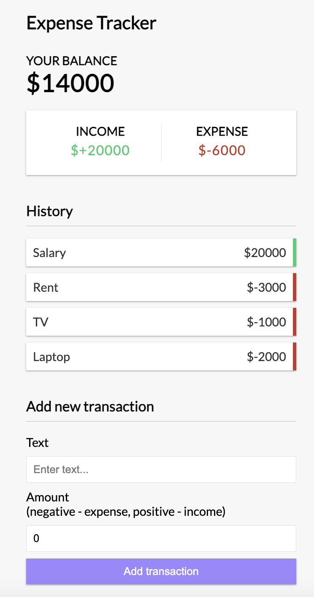

# Expense Tracker

This is a simple Expense Tracker application built using Vue.js with the Composition API. It's designed to help users manage their personal finances by keeping track of income and expenses.



## Features

- Add income and expense transactions
- View balance, income, and expense totals
- Transaction history
- Persistent storage through `localStorage`

## Project Setup

```bash
# clone the repository
git clone https://github.com/your-username/expense-tracker.git

# navigate to the app's directory
cd expense-tracker

# install dependencies
npm install

# serve with hot reload at localhost:3000
npm run dev

# build for production with minification
npm run build
```

## Usage

After setting up the project, you can add transactions using the form provided in the UI. Each transaction requires a description ("Text") and the amount, which should be input as a positive number for income or a negative number for expenses.
